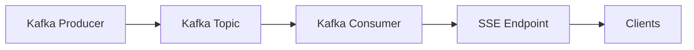

# Event Sourcing

Event sourcing is a software architecture pattern that focuses on capturing and storing all changes to an application's state as a sequence of events. Instead of directly modifying the current state, every change is represented as an event that describes what happened. **This allows for a complete history of changes**, enabling features like auditing, debugging, and the ability to reconstruct past states.

## Benefits of Event Sourcing

1. **Auditability**: Since every change is recorded as an event, you can easily track who made changes and when they occurred.
2. **Reproducibility**: You can replay events to reconstruct the state of the application at any point in time, which is useful for debugging and testing.
3. **Scalability**: Event sourcing can help with scaling applications, as events can be processed asynchronously and stored in a way that allows for efficient querying.
4. **Flexibility**: It allows for more flexible data models, as you can evolve the structure of events without affecting the current state.

## Implementing Event Sourcing  

To implement event sourcing, you typically follow these steps:  
1. **Define Events**: Identify the events that represent changes in your application. Each event should have a clear name and contain relevant data about the change.
2. **Store Events**: Use an event store to persist the events. This can be a database or a specialized event storage system.
3. **Reconstruct State**: Create a mechanism to reconstruct the current state of the application by replaying the events in order.
4. **Handle Commands**: Implement command handlers that process user actions and generate corresponding events.

#### Example
```js
// Define an event
class UserCreatedEvent {
  constructor(userId, username) {
    this.userId = userId;
    this.username = username;
    this.timestamp = new Date();
  }
}

// Store events
const eventStore = [];
function saveEvent(event) {
  eventStore.push(event);
}

// Reconstruct state
function reconstructState() {
  const users = {};
  for (const event of eventStore) {
    if (event instanceof UserCreatedEvent) {
      users[event.userId] = { username: event.username };
    }
  }
  return users;
}

// Handle commands
function createUser(userId, username) {
  const event = new UserCreatedEvent(userId, username);
  saveEvent(event);
}

// Example usage
createUser(1, 'Alice');
createUser(2, 'Bob');
const currentState = reconstructState();
console.log(currentState); // { '1': { username: 'Alice' }, '2': { username: 'Bob' } }
```

### Advantages over traditional CRUD:
<!-- TABLE VIEW -->
| Aspect               | Event Sourcing                          | Traditional CRUD                        |
|----------------------|-----------------------------------------|-----------------------------------------|
| **Data Storage**         | Stores events as a sequence of changes   | Stores current state directly             |
| **State Reconstruction** | Can reconstruct past states by replaying events | Cannot reconstruct past states easily |
| **Auditing**             | Provides a complete history of changes    | Limited auditing capabilities             |  
| **Scalability**          | Can process events asynchronously         | May require complex transactions         |


#### Hinglish Talk

- Event sourcing ek software architecture pattern hai jisme hum application ke state ke changes ko events ke form mein capture karte hain. 
- Isse hume application ke changes ka **complete history** milta hai, jisse hum auditing, debugging, aur past states ko reconstruct kar sakte hain.
- Event sourcing ke benefits mein **auditability**, **reproducibility**, **scalability**, aur **flexibility** shamil hain.
- Event sourcing implement karne ke liye, hume events define karne hote hain, unhe store karna hota hai, state reconstruct karna hota hai, aur commands handle karne hote hain.
- Event sourcing traditional CRUD se alag hai kyunki yeh events ke form mein data store karta hai, jabki CRUD current state directly store karta hai.

Note: Event sourcing is a complex pattern and may not be suitable for all applications. It's important to evaluate the specific needs of your application before deciding to implement event sourcing.

## When to Use Event Sourcing vs SSE (Server-Sent Events) in Hinglish
- **Event sourcing** tab use karna chahiye jab *aapko application ke state ke changes ka complete history chahiye*, aur aapko state ko reconstruct karne ki zarurat hai.
- **SSE** tab use karna chahiye jab *aapko real-time updates chahiye, jaise ki notifications ya live data feeds*, bina client ko continuously poll karne ke.
- Event sourcing aur SSE dono ek saath bhi use kiye ja sakte hain, jahan event sourcing *application ke state changes ko capture karta* hai, aur *SSE real-time updates provide karta hai* clients ko.
- Event sourcing zyada complex hai aur zyada resources consume kar sakta hai, isliye chhote applications ke liye SSE hi kaafi hota hai.

### TABLE VIEW - Event Sourcing vs SSE vs Transaction Box.

| Aspect               | Event Sourcing                          | SSE (Server-Sent Events)                 | Transaction Box                         |
|----------------------|-----------------------------------------|-----------------------------------------|-----------------------------------------|
| **Purpose**          | Captures and stores all changes as events | Provides real-time updates to clients | Manages database transactions            |
| **Data Storage**     | Stores events in an event store                     | Does not store data, just sends updates | Stores transaction data in a database |
| **State Reconstruction** | Can reconstruct past states by replaying events | Cannot reconstruct past states | Not applicable                          |
| **Use Case**         | Auditing, debugging, complex state management | Real-time notifications, live data feeds | Ensuring data integrity during transactions |
| **Complexity**         | High                                    | Low                                     | Medium                                  |
| **Resource Consumption** | Can be high due to event storage and processing | Low                                     | Medium                                  |
| **Scalability**          | Can process events asynchronously         | Can handle many clients with real-time updates | Depends on database performance         |
| **Example**          | E-commerce order processing, user activity tracking | Live sports scores, social media updates | Banking transactions, inventory management |
| **Advantages**         | Provides complete history, allows state reconstruction | Simple to implement, efficient for real-time updates | Ensures data integrity, supports complex transactions |
| **Disadvantages**      | Can be complex to implement and maintain, may require more resources | Not suitable for applications thats require state reconstruction | Can be complex to manage, may require additional infrastructure |
| **When to Use**         | When you need a complete history of changes and the ability to reconstruct past states | When you need to provide real-time updates to clients without the need for state reconstruction | When you need to manage complex transactions and ensure data integrity |
| **When Not to Use**         | When your application does not require a complete history of changes or state reconstruction | When your application requires state reconstruction or complex transaction management | When your application does not require complex transactions or data integrity management |
| **Hinglish Talk**         | Jab aapko application ke state ke changes ka complete history chahiye aur aapko state ko reconstruct karne ki zarurat hai | Jab aapko real-time updates chahiye, jaise ki notifications ya live data feeds, bina client ko continuously poll karne ke | Jab aapko complex transactions manage karne hain aur data integrity ensure karni hai |

## How to integrate Kafka with SSE in Hinglish
- Kafka ko SSE ke saath integrate karne ke liye, aapko Kafka consumer set up karna hoga jo Kafka topic se messages consume karega.
- Jab Kafka consumer ek message consume karta hai, to aap us message ko SSE format mein convert kar sakte hain aur clients ko real-time updates bhej sakte hain.
- Aapko SSE endpoint create karna hoga jahan clients connect kar sakte hain aur updates receive kar sakte hain.
- Kafka consumer ko continuously run karna hoga taaki wo Kafka topic se messages consume karta rahe aur clients ko updates bhejta rahe.
- Is integration se aap Kafka ke powerful messaging capabilities ka use kar sakte hain aur clients ko real-time updates provide kar sakte hain without the need for clients to continuously poll for updates.

#### Diagram


### Conclusion
Kafka aur SSE ka integration aapko powerful real-time updates provide karne mein madad karta hai, jisse aap apne applications ko zyada responsive aur interactive bana sakte hain. However, it's important to ensure that your Kafka consumer is properly configured to handle the load and that your SSE endpoint can manage multiple client connections efficiently. 
