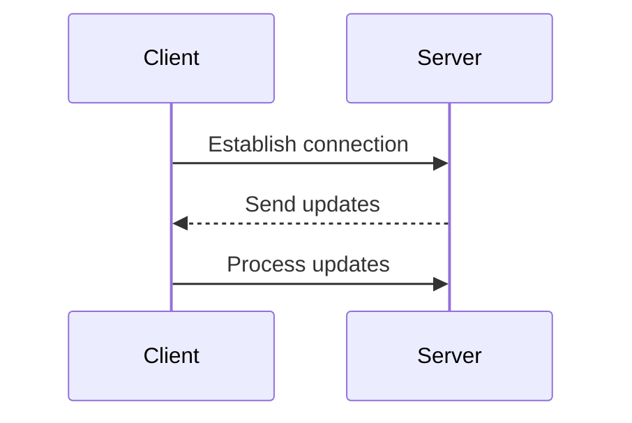

# Server Sent Events

Server Sent Events (SSE) is a technology that allows a server to push real-time updates to a web client over a single HTTP connection. It is a simple and efficient way to send data from the server to the client without the need for the client to continuously poll the server for updates.

## How SSE Works
1. The client establishes a connection to the server using an HTTP request.
2. The server keeps the connection open and sends updates to the client as they become available.
3. The client receives the updates and processes them accordingly.

### Diagram using Mermaid



## Benefits of SSE
- **Simplicity**: SSE is easy to implement and use, as it relies on standard HTTP protocols.
- **Efficiency**: SSE uses a single connection to send updates, reducing overhead compared to other methods like WebSockets.
- **Automatic Reconnection**: If the connection is lost, the client can automatically attempt to reconnect to the server, ensuring that updates are not missed.

## Code Example
Here is a simple example of how to implement SSE on the server and client side.

### Server-Side (Node.js)

```javascript
const http = require('http');
http.createServer((req, res) => {
    if (req.url === '/events') {
        res.writeHead(200, {
            'Content-Type': 'text/event-stream',
            'Cache-Control': 'no-cache',
            'Connection': 'keep-alive'
        });

        setInterval(() => {
            const data = `data: ${new Date().toLocaleTimeString()}\n\n`;
            res.write(data);
        }, 1000);
    } else {
        res.writeHead(404);
        res.end();
    }
}).listen(3000, () => {
    console.log('Server is running on http://localhost:3000');
});
```
### Client-Side (HTML/JavaScript)
```html
<!DOCTYPE html>
<html lang="en">
  <head>
    <meta charset="UTF-8">
    <meta name="viewport" content="width=device-width, initial-scale=1.0">
    <title>SSE Example</title>
  </head>
  <body>
    <h1>Server Sent Events Example</h1>
    <div id="events"></div>
    <script>
        const eventSource = new EventSource('/events');
        const eventsDiv = document.getElementById('events');

        eventSource.onmessage = function(event) {
            const newElement = document.createElement('div');
            newElement.textContent = `Received: ${event.data}`;
            eventsDiv.appendChild(newElement);
        };

        eventSource.onerror = function() {
            console.error('Error occurred while receiving events.');
            eventSource.close();
        };
    </script>
  </body>
</html>
```

### Conclusion
Server Sent Events is a powerful and efficient way to enable real-time communication between a server and a web client. It is particularly useful for applications that require live updates, such as news feeds, stock tickers, or chat applications. By leveraging SSE, developers can create responsive and dynamic web applications with minimal overhead and complexity.